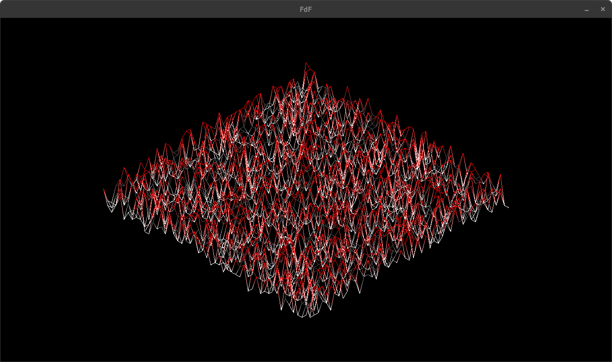

# FDF

## Overview
**FDF** (short for *Fil De Fer*, French for *wireframe*) is a 42 school project focused on 3D wireframe rendering. The goal is to read a `.fdf` file containing 3D altitude data and render it as a wireframe model using **isometric projection**.

The project uses **MinilibX**, the graphical library developed at 42, to open a window, render images, and handle keyboard and mouse events.

---

## Status
- Completion Date: 02/01/2025
- Grade: 125/100

---

## Objectives

- Parse a 3D map file (`.fdf`)
- Project coordinates in **isometric view**
- Draw line segments between points to create a wireframe mesh
- Use MinilibX to render the output in a graphical window
- Handle keyboard/mouse events properly (e.g., clean exit)

---

## Installation

```bash
# Clone the repositery
git clone git@github.com:0xAttra/FdF.git && cd FdF

# Compile the mandatory version
make

# Compile with bonus features
make bonus

# Run the program
./fdf(_bonus) maps/[...].fdf
```

## Features
- Isometric 3D rendering
- Parsing of properly formatted `.fdf` map files
- Display in a graphical window using MinilibX
- ESC key or window close button cleanly exits the program

## Bonus (optional enhancements)
- Rotate the map (X, Y, Z axis)
- Zoom in / out
- Translate the map (move it within the window)
- Switch between projection types (isometric, parallel)
- Apply color gradients based on elevation

## Example Output



---
Author: macuesta
Last Updated: 18/06/2025
